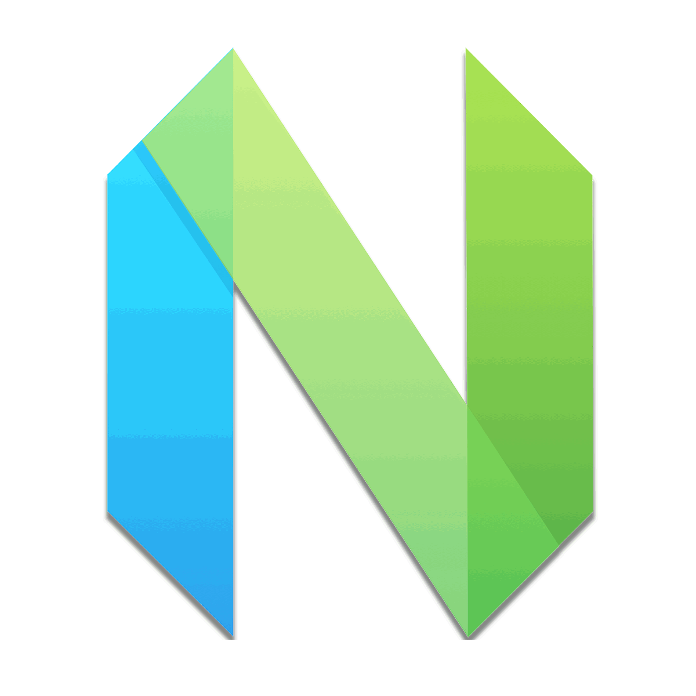

autoscale: true
theme: Scherzkeks

# [fit] WELCOME!
# [fit] [@VimIndy][vimindy] 08.2016

 

# [fit] :milky_way: spacemacs_ :milky_way:

----

# *Our Sponsors*

----

![inline][smartfile_logo]

[@SmartFile][smartfile] provides us with this space and the beer! :office: :beers:

----

![inline][sixfeetup_logo]

[@SixFeetUp][sixfeetup] provides us with the pizza! :pizza:

----

![inline][its_logo]

[@InvisTigerSound][its] provides us with AV help! :movie_camera:

----

# [fit] *News* **and**
# [fit] *Notables*

----

:colors deep-space

[tyrannicaltoucan/vim-deep-space](https://github.com/tyrannicaltoucan/vim-deep-space) Designed for GUI Vim and 24-bit ('true-color') terminals

----

Plugins of interest

[janko-m/vim-test](https://github.com/janko-m/vim-test)
[@vimgifs](https://twitter.com/vimgifs)

----

[neovim/wiki/Related-projects](https://github.com/neovim/neovim/wiki/Related-projects)

----

Looking for sticker / shirt / etc. sponsors.

[//]: # ( Links                                                               )
[//]: # ( ------------------------------------------------------------------- )
[vimindy]: https://twitter.com/vimindy

[//]: # ( Sponsors                                                            )
[smartfile]: https://www.smartfile.com/
[smartfile_logo]: images/smartfile_logo.png
[sixfeetup]: https://www.sixfeetup.com/
[sixfeetup_logo]: images/sixfeetup_logo.png
[its]: https://twitter.com/invistigersound
[its_logo]: images/its_logo.jpg
[//]: # ( ------------------------------------------------------------------- )
